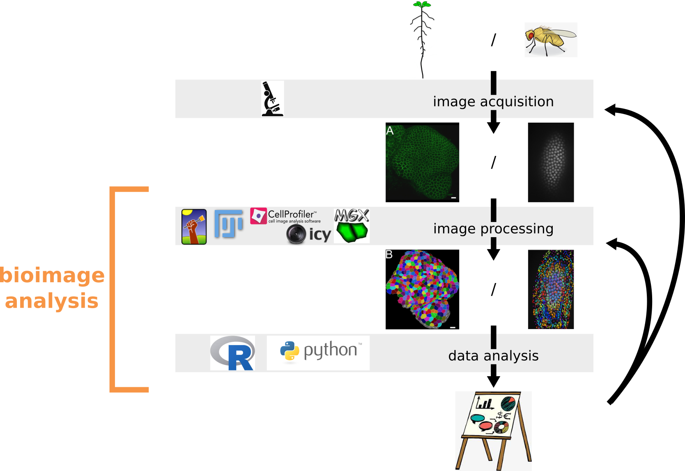

```{r setup, include=FALSE}
options(htmltools.dir.version = FALSE)
library(here)
```

layout: true

<div class="my-footer">
  <div class="my-info">
      <a href="https://marionlouveaux.fr/">marionlouveaux.fr</a>
      <a href="https://twitter.com/MarionLouveaux">@MarionLouveaux</a>
  </div>
  <div class="my-logo">
  </div>
</div>       

---

# Bioimage analysis includes data analysis
```{r, echo=FALSE, out.width="100%", fig.align='center'}

```

---

# Why using a programming langage to perform data analysis?

.pull-left60[
```{r, echo=FALSE, out.width="100%", fig.align='center'}

```
]

.pull-right40[
- get reproducible analyses
- share with others   
- re-use later       
- keep raw data raw      
]
---

# Get Started: R studio and .Rproj
```{r, echo=FALSE, out.width="80%", fig.align='center'}

```

.remark[ Double clic on **TS10_Rintro.Rproj** ]

---

# Get Started: R studio and .Rproj
```{r, echo=FALSE, out.width="80%", fig.align='center'}

```

.remark[  Double clic on **TS10_Rintro.Rproj** ]
---

# 00_Getting started: R markdown

```{r, echo=FALSE, out.width="80%", fig.align='center'}
knitr::include_graphics("images/Rmarkdown.png")
```

.remark[
Bottom right panel of Rstudio: `Files -> scripts`      
Click on `00_GettingStarted.Rmd`      
]
---

# 00_Getting started: R markdown
```{r, echo=FALSE, out.width="80%", fig.align='center'}

```

.remark[
Bottom right panel of Rstudio: `Files -> scripts`      
Click on `00_GettingStarted.Rmd`      
]
---

# Why using an R project and Rmarkdown

We aim at avoiding this situation:     
```{r, echo=FALSE, fig.align='center'}
knitr::include_graphics("images/irreproducible.gif")
```

> http://phdcomics.com/comics/archive.php?comicid=1689
---

# 01_Rbasics

### Execute a command     

`ctrl + enter` to execute a command.      
NB: `cmd + enter` on Mac.

### Assign a value to a variable

```{r}
my_age <- 29
```
my_age is a **variable**.
We **assign** 29 to my_age.

.remark[
Bottom right panel of Rstudio: `Files -> scripts`      
Click on `00_GettingStarted.Rmd`      
]
---

# 02_Exercise1

.pull-left[
We'll work on the data from the tracking session:
- developing Drosophila embryo, carrying a histone-RFP marker      
- timelapse (31 frames, frame delay = 30 seconds)          
- pixel size 0.52x0.52x2.5 µm3        
]

.pull-right[
```{r, echo =FALSE, fig.align='center', out.width="60%"}
knitr::include_graphics("images/AVG_division_timelapse.gif")
```
]

.remark[
**All data are** available **in the .Rproj folder "/datasets/fly_embryo".**
]
---

# 02_Exercise1: Goals

To be able to produce a plot like this one...    

```{r, echo=FALSE, results=FALSE, warning=FALSE, message=FALSE}
library(magrittr)
library(dplyr)
library(readr)
library(here)
library(ggplot2)
library(ggthemes)

custom_plot_theme <- function(...){
theme_bw() +
theme(panel.grid = element_blank(),
      axis.line = element_line(size = .7, color = "black"),
axis.text = element_text(size = 28),
axis.title = element_text(size = 30),
legend.text = element_text(size = 28),
legend.title = element_text(size = 30),
legend.key.size = unit(0.4, "cm"),
strip.text.x = element_text(size = 30, colour = "black", angle = 0),
strip.text.y = element_text(size = 30, colour = "black", angle = 90))
}
```

```{r, echo=FALSE, results=FALSE, warning=FALSE, message=FALSE, fig.align='center', out.width="50%"}


df_fly_spots <- read_csv(here("datasets/fly_embryo/division_timelapse_spot_stats.csv"))

nb_nuclei <- df_fly_spots %>% 
  group_by(FRAME) %>% 
  summarise(nb = n())

df_fly_spots2 <- left_join(df_fly_spots, nb_nuclei) 

ggplot(df_fly_spots2, aes(FRAME, nb)) + 
  geom_point() +
  geom_line() +
  xlab("FRAME") + 
  ylab("Number of nuclei") +
  custom_plot_theme()
```
---

# 02_Exercise1: Goals

... using only a few lines of code

```{r, echo=TRUE, results=FALSE, warning=FALSE, message=FALSE, fig.align='center', out.width="50%", fig.keep='none'}
df_fly_spots <- read_csv(here(
  "datasets/fly_embryo/division_timelapse_spot_stats.csv"
))

nb_nuclei <- df_fly_spots %>% 
  group_by(FRAME) %>% 
  summarise(nb = n())

df_fly_spots2 <- left_join(df_fly_spots, nb_nuclei) 

ggplot(df_fly_spots2, aes(FRAME, nb)) + 
  geom_point() +
  geom_line() +
  xlab("FRAME") + 
  ylab("Number of nuclei") +
  custom_plot_theme()
```
---


# 02_Exercise1: librairies

R uses additionnal librairies, that must be loaded for each script using `library()`.      
```{r}
library(readr)
```

Here, we will mainly work with
- `readr` (to read csv)         
- `dplyr` (to wrangle data)           
- `magrittr` (%>% symbol)          
- and `ggplot2` (to plot)     
---


# 02_Exercise1: read and view a dataframe

To read a .csv file, we will use the read_csv function from readr. This function reads the content of the csv and gives an object called "tibble"" (= a sort of dataframe) as an output.    
```{r, eval=FALSE}
dataframe <- read_csv("path_to_my_csv.csv")
```

We can visualise the content of the dataframe using head() or View().
```{r, eval=FALSE}
dataframe %>% 
  head()

# To see the whole table (be careful with big dataframes!!)
dataframe %>% 
  View()
```
---

# 02_Exercise1: the pipe symbol %>%

The pipe symbol is used **to chain instructions**, as you would do for a cooking recipe:     

.pull-left60[
```{r, eval=FALSE}
omelette_with_chives <- egg %>% 
  crack(add_seasoning) %>% 
  beat() %>% 
  cook(add_chives)
```
]

.pull-right40[
```{r, echo =FALSE, fig.align='center', out.width="70%"}

```
]

> From: http://perso.ens-lyon.fr/lise.vaudor/utiliser-des-pipes-pour-enchainer-des-instructions/
---

# 02_Exercise1: mutate()

mutate() = to add a new column

```{r, eval=FALSE}
result <- data %>% 
  mutate(new_column_name = expression)
```

```{r, echo=FALSE, out.width="80%", fig.align='center'}

```
---

# 02_Exercise1: select()

select() = to select or exclude **columns** in the dataframe

```{r, eval=FALSE}
result <- data %>% 
  select(column1_to_keep, column2_to_keep, column3_to_keep)

result <- data %>% 
  select(-column_to_exclude)
```

```{r, echo=FALSE, out.width="80%", fig.align='center'}

```
---

# 02_Exercise1: Plots with ggplot2   

```{r, echo=FALSE, out.width="90%", fig.align='center'}

```

.remark[
**/!\ Do not mix %>% and +** (specific to plots) **/!\**
]
---

# 02_Exercise1: filter()

filter() = to filter **rows** on one or several conditions

```{r, eval=FALSE}
result <- data %>% 
filter(condition1)

result <- data %>% 
filter(condition1 & condition2) # AND

result <- data %>% 
filter(condition1 | condition2) # OR
```

```{r, echo=FALSE, out.width="80%", fig.align='center'}

```
---


# 02_Exercise1: summarise()

summarise() = to **resume** a column into one value (mean, median, sum...)
```{r, eval=FALSE}
result <- data %>%
  summarise(new_column_name = function(column_of_interest))
```

```{r, echo=FALSE, out.width="80%", fig.align='center'}

```
---

# 02_Exercise1: group_by()

group_by() = to group the rows according to a categorical variable.
```{r, eval=FALSE}
result <- data %>%
  group_by(categorical_variable_of_interest)
```

```{r, echo=FALSE, out.width="80%", fig.align='center'}

```
---

# 02_Exercise1: group_by() and summarise()

```{r, eval=FALSE}
result <- data %>%
  group_by(categorical_variable_of_interest) %>% 
  summarise(new_column_name = function(column_of_interest))
```

```{r, echo=FALSE, out.width="80%", fig.align='center'}

```
---

# 02_Exercise1: left_join()

left_join() = to combine tables, with the left table as reference.    

```{r, eval=FALSE}
result <- data1 %>%
  left_join(data2, by = "column_name")
```

```{r, echo=FALSE, out.width="80%", fig.align='center'}

```
---

# 02_Exercise1: Plots with ggplot2 - reminder   

```{r, echo=FALSE, out.width="90%", fig.align='center'}

```

.remark[
**/!\ Do not mix %>% and +** (specific to plots) **/!\**
]
---

# 03_Find_help: in R/Rstudio

## Package documentation
```{r, eval=FALSE}
# Package documentation
help(package = "NAME_of_PACKAGE")

# Help for a specific function
?NAME_of_FUNCTION
```


## Rstudio cheatsheets 
.pull-left[
```{r, echo=FALSE, fig.align="center", out.width="100%"}

```
]

.pull-right[
```{r, echo=FALSE, fig.align="center", out.width="100%"}

```
]

---

# 03_Find_help: Online or not

**Google**, **StackOverflow**, **Twitter**...         

but also      

.pull-left60[
**R meetups** (R ladies, UseR groups...): 
- https://www.meetup.com         
- https://rladies.org/     

**Conferences**:     
useR! (Toulouse, July 9-12 2019)         
SatRday (Paris, 23rd of February 2019)       

**Remote groups**:        
- R ladies remote group        
- French speaking remote group "Grrr"        
]

.pull-right40[
```{r, echo=FALSE, out.width="80%", fig.align='center'}

```
]

.remark[
Dont' forget to use a **reprex** = reproducible example.     
]
---

# 04_Exercise2: Goals

- Apply knowledge from Exercise1       
- Learn how to navigate through the documentation of a package             


.pull-left60[
Be aware that this part of the session relies on two librairies (`mamut2r` and `cellviz3d`) that are still under development.
]
       
.pull-right40[
```{r, echo=FALSE, fig.align="center", out.width="60%"}
knitr::include_graphics("images/underconstrution.png")
```
]

<br> 
> mamut2r and cellviz3d are available on GitHub:
- https://github.com/marionlouveaux/mamut2r         
- https://github.com/marionlouveaux/cellviz3d          
See Bonus_Install.Rmd for instructions on how to install these librairies on your own computer.         
---

# 04_Exercise2 

Display mean fluorescence intensity in 3D+time.       

```{r, echo=FALSE, fig.align="center", out.width="100%"}

```

The lower values of fluorescent intensity are close to the border of the sample.       
---

# 04_Exercise2

Display **filtered** mean fluorescence intensity in 3D+time. 

```{r, echo=FALSE, fig.align="center", out.width="100%"}

```
Mean fluorescence intensity tends to be lower right after a division.      
---

# 04_Exercise2

Compute and display the division status (ready to divide or not) in 3D+time.     

```{r, echo=FALSE, fig.align="center", out.width="100%"}

```
We can spot simultaneous divisions.      
---

# 04_Exercise2

Compute and display a **metric to look for false detected spot** based on the change of mean fluorescence intensity over a division.      

```{r, echo=FALSE, fig.align="center", out.width="100%"}

```
---

# 05_Going_further

## Citation
Don't forget to cite R and the packages you use!

```{r, eval=FALSE}
# To get R citation
citation()
```

```{r, eval=FALSE}
# To get citation for the ggplot2 package
citation(package = "ggplot2")
```
---

# Acknowledgements

- **Local organisers**: Aymeric d'Hérouel and Andreas Girod         
- **NEUBIAS chair**: Julien Colombelli          
- **TS10 and TS11 organisers and helpers**: Kota Miura, Jean-Yves Tinevez, Gaby Martins, Jonas Øgaard, Joyce Kao, Fabrice Cordelières, Ignacio Arganda-Carreras         
- **Data**: Robert Haase          
- **mamut2r and cellviz3d help**: Sébastien Rochette, Friederike Preu, Mike Smith
- **MaMuT help**: Jean-Yves Tinevez, Tobias Pietzsch, John Bogovic

<br>

The format of this session was inspired by the Little Miss Tidyverse workshop given by Danielle Navarro for the Rladies Sydney (https://github.com/rladiessydney/littlemisstidyverse).      


